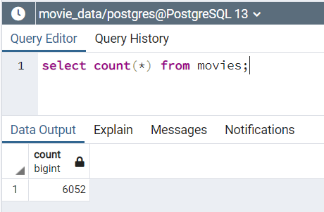
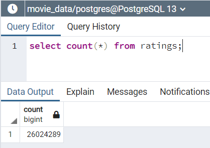

# Movies-ETL
## Project Overview
Amazing Prime loves the dataset and wants to keep it updated on a daily basis. Britta needs your help to create an automated pipeline that takes in new data, performs the appropriate transformations, and loads the data into existing tables. You’ll need to refactor the code from this module to create one function that takes in the three files—Wikipedia data, Kaggle metadata, and the MovieLens rating data—and performs the ETL process by adding the data to a PostgreSQL database.

## Project Deliverables
1. Write an ETL function to read three data files.
2. Extract and transform Wikipedia data.
3. Extract and transform Kaggle and MovieLens rating data.
4. Create the Movie database.

## Results
1. 6,052 records were imported into movies table.  
  
2. 26,024,289 records were imported into the ratings table.  
  